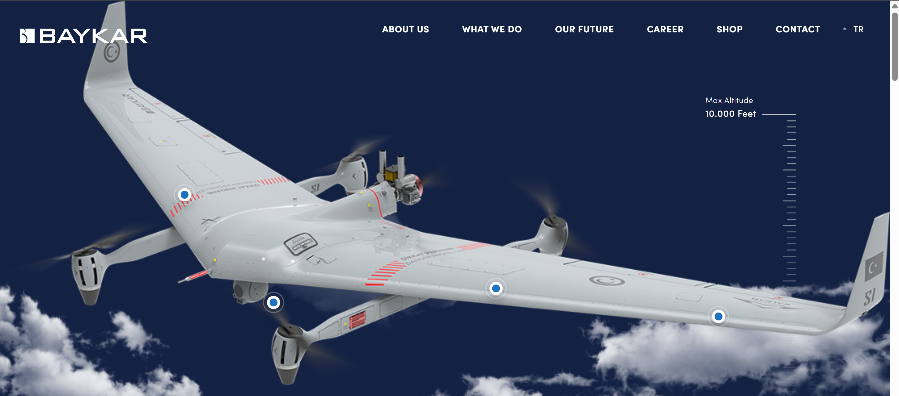
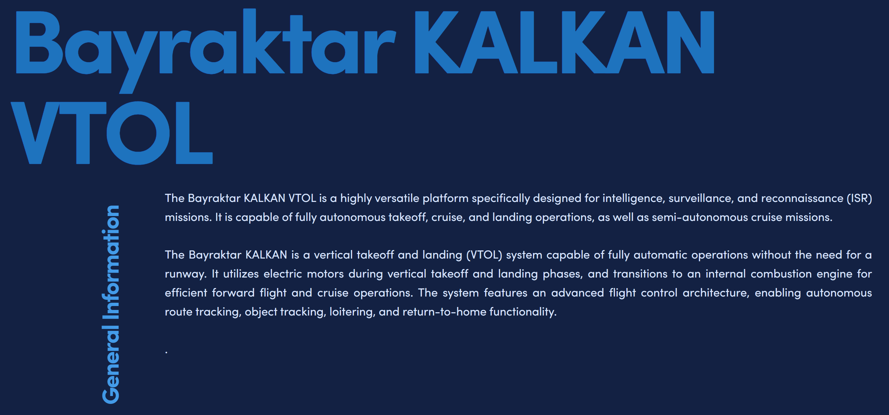
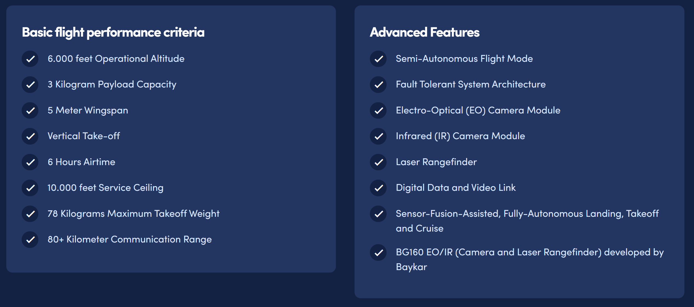
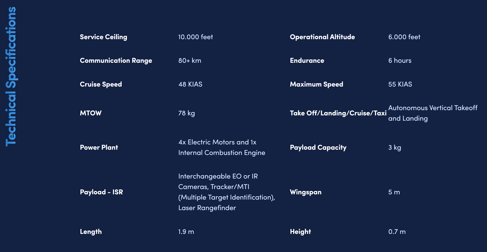
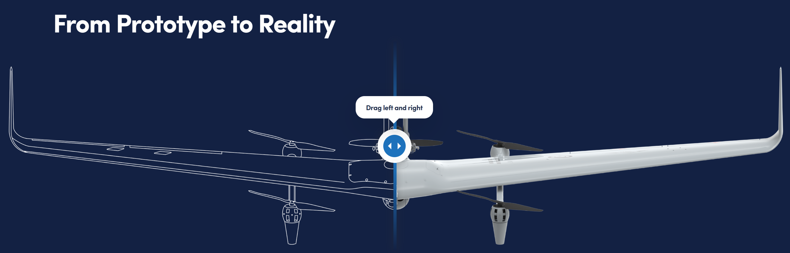
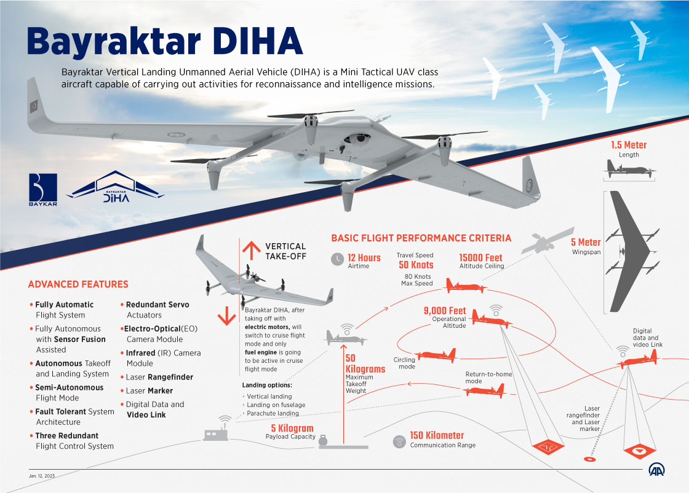

# Bayraktar DİHA VTOL 無人機逆向工程分析報告

**課程：** 工科海工專論  
**報告人：** 施子嚴、葉哲綸、王心妤  
**研究對象：** Bayraktar Kalken DİHA（Dikey İniş Hava Aracı）  
**製造商：** Baykar Teknoloji（土耳其）  
**報告日期：** 2026年3月  









## 目錄

1. [平台概述](#1-平台概述)
2. [應用場域分析](#2-應用場域分析)
   - 2.1 軍事應用
   - 2.2 民用潛力
3. [逆向工程分析](#3-逆向工程分析)
   - 3.1 機構設計（氣動外形與結構）
   - 3.2 電系分析
   - 3.3 飛行力學與控制系統
   - 3.4 通訊系統
4. [製造工藝探討](#4-製造工藝探討)
5. [結語](#5-結語)
6. [參考資料](#6-參考資料)

---

## 1. 平台概述

Bayraktar DİHA（Dikey İniş Hava Aracı，土耳其語意為「垂直降落無人機」）是由土耳其 Baykar 公司開發的**混合動力 VTOL 無人飛行載具（UAV）**，首次亮相於 2019 年，並於 2021 年 TEKNOFEST 航太展正式對外發布。該機屬於 Mini Tactical UAV 等級，後續升級版本稱為 **Bayraktar KALKAN DİHA**。

### 主要性能諸元

| 參數 | 數值 |
|------|------|
| 翼展 | 5.0 公尺 |
| 機身長度 | 1.5 公尺 |
| 最大起飛重量（MTOW） | 30 公斤（DİHA）／78 公斤（KALKAN，Baykar 官網） |
| 酬載重量 | 5 公斤（DİHA）／3 公斤（KALKAN） |
| 最大速度 | 80 節（約 148 km/h）（DİHA）／55 KIAS（KALKAN） |
| 巡航速度 | 48 KIAS（KALKAN 官方值） |
| 任務高度 | 9,000 呎（DİHA）／6,000 呎（KALKAN 官方作戰高度） |
| 升限 | 15,000 呎（DİHA）／10,000 呎（KALKAN 官方升限）；飛行測試曾達 14,500 呎 |
| 續航時間 | 12 小時（DİHA 理論值）／6–8 小時（KALKAN；官方 6 小時，測試紀錄達 8 小時） |
| 通訊距離 | 80–150 公里 |
| 起降模式 | 垂直起降 / 機腹著陸 / 降落傘 |

---

## 2. 應用場域分析

### 2.1 軍事應用

DİHA 的設計核心圍繞著**戰術情報、監視與偵察（ISR）**任務。其無跑道起降能力賦予前線部隊高度彈性。

#### 2.1.1 地面作戰支援

在複雜地形（山地、叢林、都市環境）中，傳統固定翼無人機因需要跑道而難以部署，DİHA 利用垂直起降特性，可從**20×20 公尺的限縮空間**直接升空。前線指揮官無需倚賴遠方基地即可獲得即時空中情報。

**典型任務流程：**
1. 地面部隊迅速展開地面控制站（GCS）
2. DİHA 從任意平坦地點垂直起飛
3. 切換至固定翼巡航，以汽油引擎持續飛行 6–12 小時
4. 利用 EO/IR 攝影機進行目標偵測與追蹤
5. 即時回傳影像情資至指揮部
6. 自主垂直降落返回回收點

#### 2.1.2 艦載作戰

DİHA 是土耳其海軍**TCG Anadolu（兩棲攻擊艦）**無人機空中群的候選平台之一。艦上有限的甲板空間使垂直起降能力不可或缺。此外，DİHA 可作為 Bayraktar TB2 的**通訊中繼節點**，延伸整體戰術覆蓋範圍。

#### 2.1.3 邊境警戒與海上巡邏

長航時（KALKAN 版達 6–8 小時；原版 DİHA 理論值達 12 小時）配合 150 公里通訊範圍，使 DİHA 能夠對廣大邊境地帶進行持續性監控，並在夜間利用熱成像（LWIR）執行任務。

---

### 2.2 民用潛力

儘管 DİHA 定位為軍用平台，其技術架構亦適用於多項民間任務：

#### 2.2.1 災害搜救

混合動力架構提供的長續航時間，對於尋找失蹤人員或評估大範圍災後損毀（颶風、洪水、地震）具有明顯優勢。EO/IR 多光譜感測器可在夜間或低能見度下偵測生命跡象。

#### 2.2.2 電力與管線基礎設施巡檢

電力公司可利用 DİHA 的高解析度攝影機對高壓輸電線路進行自動路線追蹤巡檢，取代危險的人工巡線作業；石油天然氣業者亦可用於管線洩漏監測。

#### 2.2.3 精準農業與環境監測

搭載多光譜相機後，DİHA 可對大面積農地進行 NDVI 植被指數分析，協助農民決策施肥與灌溉。其熱成像功能亦可用於森林野火早期偵測。

#### 2.2.4 海洋與漁業執法

海巡機關可利用 DİHA 監控非法捕魚、偷渡及海洋環境污染事件，無需消耗昂貴的直升機飛行時數。

---

## 3. 逆向工程分析

### 3.1 機構設計（氣動外形與結構）

#### 3.1.1 翼身融合（Blended Wing Body）佈局

DİHA 採用**翼身融合佈局**，機身與翼翼之間無明顯分界線。此設計帶來以下優點：

- **低雷達截面積（RCS）：** 無突出機身，雷達波難以形成強反射
- **較高升阻比：** 整個機身均貢獻升力，提升巡航效率
- **緊湊的結構容積：** 將酬載艙、電池組與燃油箱整合於翼身內部

#### 3.1.2 升力旋翼佈局

機體搭載**四具電動升力旋翼（VTOL Motors）**，分置於翼面上的四個臂架位置：

```
       前旋翼(左)    前旋翼(右)
           ○             ○
    ←━━━━━━━━━━━━━━━━━━━━→  主翼（5m 翼展）
           ○             ○
       後旋翼(左)    後旋翼(右)
                ↑
          後推式螺旋槳（巡航引擎）
```

四旋翼的旋轉方向兩兩相反（差動配置），在產生升力的同時，反扭矩相互抵消，賦予機體偏航控制能力。

#### 3.1.3 後推式螺旋槳

機身後緣中央配置**單具後推式螺旋槳（Pusher Propeller）**，由 BAYKUŞ 二行程汽油引擎驅動，功率約 12 馬力，重量（含輔助系統）約 4.5 公斤。後推佈局的優勢：
- 機首方向無螺旋槳擾流，利於感測器清晰視野
- 降低振動對光電酬載的影響

#### 3.1.4 材料與結構製造

推估 DİHA 主要採用以下材料：

| 部位 | 推估材料 |
|------|--------|
| 主翼結構 | 碳纖維複合材料（CFRP）+ 蜂巢夾心 |
| 機身外殼 | 玻璃纖維複合材料（GFRP） |
| 旋翼臂架 | CFRP 管材 |
| 螺旋槳葉片 | 碳纖維強化環氧樹脂 |
| 起落裝置 | 碳纖維管 / 鋁合金 |

翼身融合外殼以模具一體成型，減少結構接頭數量，降低重量並提高結構強度。

---

### 3.2 電系分析

#### 3.2.1 混合動力架構

DİHA 的核心電系架構為**串聯混合動力系統（Series Hybrid）**：

```
[汽油引擎 BAYKUŞ]
       ↓
[發電機 / 交流發電機]
       ↓ 整流
[直流匯流排（DC Bus）]
       ↓                    ↓
[鋰聚合物電池組（LiPo）]   [4× VTOL 無刷馬達]
       ↓
[電源管理系統（BMS/PMS）]
       ↓
[飛控電腦 / 感測器 / 通訊]
```

- **垂直起降階段：** 電池組供電驅動四具電動升力馬達，耗能高但時間短
- **巡航階段：** 汽油引擎獨力推進，同時發電補充電池，維持電力系統穩定
- **發電機功能：** 在巡航期間將電池恢復至完整容量，確保後續 VTOL 降落的電能儲備

#### 3.2.2 無刷電動馬達（VTOL 升力馬達）

推估規格：
- 型式：高效無刷直流馬達（BLDC）
- 轉速：每具估計 3,000–5,000 RPM（配合大直徑槳葉）
- 電子調速器（ESC）：與飛控電腦整合，實現毫秒級響應
- 旋槳直徑：推估 16–20 英寸

#### 3.2.3 電源管理系統（BMS/PMS）

關鍵功能包含：
1. **電池健康監控：** 即時監測每個電芯的電壓、溫度與 SOC（荷電狀態）
2. **過充/過放保護：** 防止電芯損壞
3. **切換邏輯：** 自動在 VTOL 模式與巡航模式間切換電能流向
4. **緊急降落備援：** 電力系統故障時自動啟動降落傘回收

---

### 3.3 飛行力學與控制系統

#### 3.3.1 飛行模式轉換（VTOL → 固定翼）

**過渡（Transition）**是混合 VTOL 最關鍵的飛行階段：

1. **垂直起飛（VTOL Phase）：**
   - 四電動旋翼差速控制提供 Roll / Pitch / Yaw
   - 飛控以 PX4/自研 RTOS 運行多個 PID 迴路（姿態+速率迴路）

2. **前飛加速（Transition Phase）：**
   - 汽油引擎後推螺旋槳啟動並逐步增大油門
   - 機體前傾，主翼開始產生升力
   - 電動旋翼油門逐漸降低，直到升力完全移轉至主翼
   - 臨界空速達到後，電動旋翼關閉

3. **巡航（Fixed-Wing Phase）：**
   - 翼面控制面（副翼、升降舵）接管姿態控制
   - 汽油引擎維持推力，同時透過連接發電機補充電力

4. **返回垂直降落（Reverse Transition）：**
   - 減速至臨界空速以下
   - 電動旋翼重新啟動
   - 垂直下降至目標點（或機腹著陸、或降落傘展開）

#### 3.3.2 飛控電腦（FCC）架構

DİHA 的飛控系統為 Baykar 自主研發，設計概念與 Bayraktar TB2 / Akıncı 一脈相承：

- **容錯架構（Fault-Tolerant）：** 多餘度感測器投票表決機制，單點故障不致失控
- **感測融合（Sensor Fusion）：** IMU（三軸陀螺儀＋加速度計）+ GPS/GNSS + 氣壓計 + 磁羅盤，以擴展卡爾曼濾波器（EKF）融合定位資料
- **自主任務模式：** 路線追蹤 / 目標環繞 / 回家模式（RTH）
- **AI 輔助追蹤：** 搭載 BG-160 系統的 AI 自動目標追蹤功能

#### 3.3.3 氣動控制面

| 控制面 | 功能 |
|--------|------|
| 副翼（Ailerons） | 橫滾（Roll）控制 |
| 升降副翼（Elevons） | 縱向俯仰（Pitch）控制 |
| 四旋翼差速 | 偏航（Yaw）及 VTOL 全自由度控制 |

---

### 3.4 通訊系統

#### 3.4.1 資料鏈架構

DİHA 採用**雙向加密資料鏈**，分別傳輸：
- **上行鏈路（Uplink）：** 指令與控制訊號（C2）、任務更新
- **下行鏈路（Downlink）：** 即時影像（EO/IR）、遙測資料、任務回報

推估工作頻段為 **L 波段或 C 波段**，最大通訊距離達 80–150 公里（視線距離 LoS 條件下）。

#### 3.4.2 延伸通訊能力（TB2 中繼）

Baykar 已驗證以 **Bayraktar TB2 作為中繼節點**，顯著延伸 DİHA 的有效通訊距離，實現超視距（BVR）資料回傳。這種「母艦無人機 + 子機」的架構在現代無人機體系中極具前瞻性。

#### 3.4.3 BG-160 光電/紅外線系統（EO/IR）

酬載核心為 Baykar 自研的 **BG-160 多光譜系統**：

| 感測器元件 | 功能 |
|-----------|------|
| 可見光相機 | 日間高解析度影像偵測 |
| 熱成像（LWIR） | 夜間目標偵測，識別人員車輛 |
| AI 影像追蹤 | 自動鎖定追蹤指定目標 |
| 雷射測距儀 | 精確定位目標坐標 |
| 雷射指示器 | 引導精確武器打擊（軍用構型） |

#### 3.4.4 GNSS 定位

系統支援 **GPS / GLONASS** 雙星定位，具備基礎抗欺騙（Anti-Spoofing）能力。在 GNSS 遭受干擾的環境下，飛控可切換至慣性導航（INS）維持基本飛行穩定。

---

## 4. 製造工藝探討

### 4.1 複合材料製造

DİHA 的機翼與機身估計採用以下工藝：

1. **乾式碳纖維預浸料（Prepreg）：** 在模具中鋪層後，進烤箱（Autoclave）或使用真空袋固化
2. **樹脂轉注成型（RTM）：** 適用於複雜曲面幾何外形的量產
3. **蜂巢夾心結構：** Nomex 蜂巢置於兩片碳纖維蒙皮之間，提供高剛性低重量的翼面結構

### 4.2 系統整合

土耳其具有高度的國防自主化意識，DİHA 的主要子系統均強調「國產化」：
- **BAYKUŞ 引擎**（Baykar 自研二行程汽油引擎）
- **BG-160 光電系統**（Baykar 自研 EO/IR 酬載）
- **飛控電腦與 GCS 軟體**（Baykar 自研）

這種垂直整合（Vertical Integration）策略降低了對外國零組件的依賴，同時使 Baykar 能掌握完整的系統知識，有助於快速迭代開發。

### 4.3 設計演進

```
2019  →  DİHA 概念發布
2021  →  TEKNOFEST 公開展示（首個量產前原型）
2022  →  飛行測試驗證（8,000 呎高度測試）
2023  →  更名升級為 KALKAN DİHA，提升 MTOW 至 78 kg（Baykar 官網）
2024  →  第 30 次飛行系統識別測試；累計 70+ 小時飛行時數
2025  →  空中發射 FPV 無人機測試（Mothership 概念）成功驗證；2025 年 11 月 27 日官方公告，單次發射 7 架 Skydagger FPV 無人機（與 Skydagger 公司合作）
```

---

## 5. 結語

Bayraktar DİHA / KALKAN DİHA 代表了土耳其無人機工業在 **VTOL 戰術 UAV** 領域的重要突破。其混合動力架構（電動 VTOL + 汽油巡航引擎）有效平衡了靈活性（無跑道部署）與續航力（KALKAN 版 6–8 小時）兩大核心矛盾。翼身融合氣動外形則在保持低可偵測性的同時提供優異升阻比。

從逆向工程角度觀察，DİHA 的設計哲學與 Baykar TB2 一脈相承：**高度國產化、模組化感測器酬載、自主飛控軟體能力**。隨著 KALKAN 版本持續進行飛行測試並驗證 Mothership 空投 FPV 概念，DİHA 系列有望成為未來戰場上**分散式無人機作戰體系**的核心節點。

---

## 6. 參考資料

1. **Baykar Teknoloji 官方網站** – Bayraktar KALKAN VTOL 產品頁  
   https://baykartech.com/en/uav/bayraktar-diha/

2. **Wikipedia** – Bayraktar VTOL（英文條目，2025 年 11 月更新）  
   https://en.wikipedia.org/wiki/Bayraktar_VTOL

3. **UAS Vision** – "Bayraktar DIHA VTOL Drone Completes Flight Test at 8,000 ft"（2023 年 1 月）  
   https://www.uasvision.com/2023/01/18/bayraktar-diha-vtol-drone-completes-flight-test-at-8000-ft/

4. **Grokipedia** – Bayraktar VTOL 技術分析（2026 年 1 月）  
   https://grokipedia.com/page/Bayraktar_VTOL

5. **Army Recognition** – "Baykar Enhances Drone Technologies with Kalkan VTOL"（2025 年）  
   https://armyrecognition.com/news/aerospace-news/2025/baykar-enhances-drone-technologies-with-kalkan-vtol-offering-an-operational-range-over-100-km

6. **Army Recognition** – "Baykar's Kalkan VTOL Drone Achieves FPV Drone Launch Test"（2025 年）  
   https://www.armyrecognition.com/news/aerospace-news/2025/baykars-kalkan-vtol-drone-achieves-fpv-drone-launch-test-marking-new-era-in-airborne-motherships

7. **Defense Here** – "Testing of Bayraktar's VTOL UAV 'KALKAN DİHA' continues"（2024 年）  
   https://defensehere.com/en/testing-of-bayraktars-vtol-uav-kalkan-diha-continues/

8. **MRO Business Today** – "Baykar successfully conducts flight demonstration on Bayraktar DIHA drone at 8,000 ft."（2023 年）  
   https://www.mrobusinesstoday.com/baykar-successfully-conducts-flight-demonstration-on-bayraktar-diha-drone-at-8000-ft/

9. **Anadolu Agency** – "Vertical-landing Bayraktar DIHA drone completes flight test at 8,000 ft"  
   https://www.aa.com.tr/en/turkiye/vertical-landing-bayraktar-diha-drone-completes-flight-test-at-8-000-ft/2786017

10. **HandWiki – Engineering:Bayraktar VTOL**  
    https://handwiki.org/wiki/Engineering:Bayraktar_VTOL

---

*本報告依公開資訊彙整，部分技術細節（如引擎型號、電氣規格）為基於同類型系統之工程推估，非官方技術文件。*